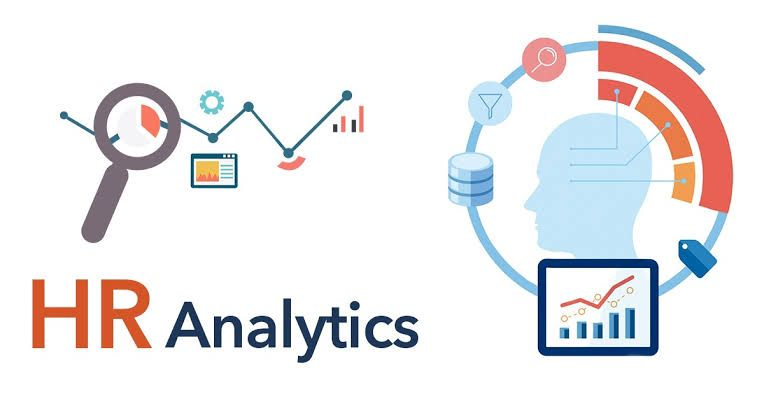

# HR-Analytics

***
## Introduction
 This **HR** data analysis, conducted using Power BI, explores employee qualification, salary distribution by job role and education level, and workforce composition. The insights highlight key trends in compensation, gender representation, and educational qualifications, supporting data-driven HR decisions.
**_Disclaimer:_** _All datasets and report do not represent any company, institution or country, but just a dummy dataset to demonstrate capabilities of power BI._

## Problem Statement
1. Determine the headcount for each job role.
2. Analyze the gender distribution among staff.
3. Assess salary discrepancies across various positions.
4. Identify the highest earners in each role.
5. Examine the relationship between qualifications and salaries.
6. Conduct an analysis of leave balances.
7. Create a streamlined HR dashboard for quick insights.

## Skills/ Concept demonstrated  
The following power BI features were incorporated:
- Power query
- DAX
- Quick measures
- Modelling
- Filter

  ## Modelling
  
  Adjusted Model            |   Auto Model
:------------------------:  |  :---------------------------:
     |  

## Visualization

The report comprises 5 visuals.

1. HR Gender
2. Salary discrepancy
3. HR Table
4. HR Year
5. %Employee and Education Qualification

## Analysis

### Employee Gender
The gender distribution is illustrated with 55% of employees being female and 45% male.

### Salary Discrepancy
The  average salary proves very relevant for ech job roles. Significant differences are also observed in the different job roles.

### HR Table
This able shows the hihestbearning employee by job title

### HR Year
Employment rate increased from 2017 to 2019.The highest number of employee was seen in 2019 and 2020 after which employment rate decline till 2013.

### % Employee and Education Qualification
These charts illustrates the breakdown of employees by education level and gender : 30% have a Bachelor's Degree, 26% possess a High School Diploma, 25% hold a Diploma, and 18% have a Master's Degree. The gender distribution is illustrated with 55% of employees being female and 45% male.

  
